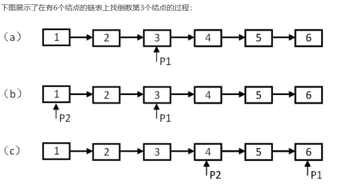

# <center> NO16 链表中倒数第k个结点
> 题目要求

    输入一个链表，输出该链表中倒数第k个结点

> 分析

    定义两个指针。

        1. 第一个指针从链表头指针开始遍历向前走k-1，第二个指针保持不动

        2. 从第k步开始，第二个指针也开始从链表的头指针开始遍历。

        3. 由于两个指针的距离保持在k-1，当第一个指针到达链表尾节点时，第二个指针正好是倒数第k个节点。
<center></center>

> 代码

```java 
/**
*    public class ListNode {
*        int val;
*        ListNode next = null;
*
*        ListNode(int val) {
*            this.val = val;
*        }
*    }
*
*/
public class Solution {
    public ListNode FindKthToTail(ListNode head,int k) {
        if(head == null || k==0)
            return null;
        ListNode temp =head;
        for(int i = 0 ; i< k-1; i++){
            if(temp.next!=null)
                temp = temp.next;
            else
                return null;
        }
        ListNode pA = head;
        ListNode pB = head;
        for(int i=0;i<k-1;i++)
            pA = pA.next;
        while(pA.next!=null){
            pA = pA.next;
            pB = pB.next;
        }
        return pB;
    }
}
```