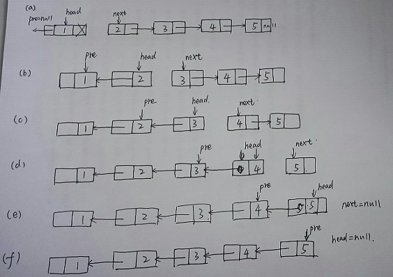

# <center> NO17 反转链表
> 题目要求

    输入一个链表，反转链表后，输出新链表的表头。

> 分析

    定义两个指针。

        1. 先用next保存head的下一个节点的信息，保证单链表不会因为失去head节点的原next节点而就此断裂

        2. 保存完next，就可以让head从指向next变成指向pre了

        3. head指向pre后，就继续依次反转下一个节点
        4. 让pre，head，next依次向后移动一个节点，继续下一次的指针反转
<center></center>

> 代码

```java 
public class Solution {
    public ListNode ReverseList(ListNode head) {
       
        if(head==null)
            return null;
        //head为当前节点，如果当前节点为空的话，那就什么也不做，直接返回null；
        ListNode pre = null;
        ListNode next = null;
        //当前节点是head，pre为当前节点的前一节点，next为当前节点的下一节点
        //需要pre和next的目的是让当前节点从pre->head->next1->next2变成pre<-head next1->next2
        //即pre让节点可以反转所指方向，但反转之后如果不用next节点保存next1节点的话，此单链表就此断开了
        //所以需要用到pre和next两个节点
        //1->2->3->4->5
        //1<-2<-3 4->5
        while(head!=null){
            //做循环，如果当前节点不为空的话，始终执行此循环，此循环的目的就是让当前节点从指向next到指向pre
            //如此就可以做到反转链表的效果
            //先用next保存head的下一个节点的信息，保证单链表反转链表，又可以称为翻转或逆置链表，它们表达的是同一个意思。以图 1 所示的链表为例： 

 
 图 1 未反转的链表

 经过反转（翻转、逆置）后，得到的新链表如图 2 所示：

 
 图 2 反转后的链表

 通过对比图 1 和 图 2 中的链表不难得知，所谓反转链表，就是将链表整体“反过来”，将头变成尾、尾变成头。那么，如何实现链表的反转呢？


## 1、迭代反转链表

 该算法的实现思想非常直接，就是从当前链表的首元节点开始，一直遍历至链表的最后一个节点，这期间会逐个改变所遍历到的节点的指针域，另其指向前一个节点。


 
 图 3 迭代反转链表的初始状态

 在上图的基础上，遍历链表的过程就等价为：3 个指针每次各向后移动一个节点，直至 mid 指向链表中最后一个节点（此时 end 为 NULL  ）。需要注意的是，这 3 个指针每移动之前，都需要做一步操作，即改变 mid 所指节点的指针域，另其指向和 beg 相同。


 
 图 4 迭代反转链表过程一

 2) 在图 4 基础上，先改变 mid 所指节点的指针域指向，另其和 beg 相同（指向节点 1 ），再将 3 个指针整体各向后移动一个节点。整个过程如图 5 所示：

 
 图 5 迭代反转链表过程二

 3) 在图 5 基础上，先改变 mid 所指节点的指针域指向，另其和 beg 相同（指向节点 2 ），再将 3 个指针整体各向后移动一个节点。整个过程如图 6 所示：

 
 图 6 迭代反转链表过程三

 4) 图 6 中，虽然 mid 指向了原链表最后一个节点，但显然整个反转的操作还差一步，即需要最后修改一次 mid 所指节点的指针域指向，另其和 beg 相同（指向节点 3）。如图 7 所示：

 
 图 7 迭代反转链表过程四

> 注意，这里只需改变 mid 所指节点的指向即可，不用修改 3 个指针的指向。

 5) 最后只需改变 head 头指针的指向，另其和 mid 同向，就实现了链表的反转。

如下是实现整个过程的代码：

```java
/*
public class ListNode {
    int val;
    ListNode next = null;

    ListNode(int val) {
        this.val = val;
    }
}*/
public class Solution {
    public ListNode ReverseList(ListNode head) {
        if(head == null || head.next == null){
            return head;
        }
        ListNode beg = null;
        ListNode mid = head;
        ListNode end = head.next;
        
        //一直遍历
        while (true)
        {
            //修改 mid 所指节点的指向
            mid.next = beg;
            //此时判断 end 是否为 NULL，如果成立则退出循环
            if (end == null) {
                break;
            }
            //整体向后移动 3 个指针
            beg = mid;
            mid = end;
            end = end.next;
        }
        //最后修改 head 头指针的指向
        head = mid;
        return head;
    }
}//时间复杂度:o(n),空间复杂度:o(1)
```

## 2. 递归反转链表

仍以图 1 中的链表为例，则整个递归实现反转的过程如下：


 
 图 8 递归反转链表过程一

 2) 在此基础上，开始执行 17、18 行代码，整个操作过程如图 9 所示，最后将 new_head 的指向继续作为函数的返回值，传给上一层的 new_head。

 
 图 9 递归反转链表过程二

> 注意，图中节点 3 的 next 指针域`∧`表示为 NULL。

 3) 再退一层，此时 new_head 仍指向节点 4，而 head 退出一层后，指向的是节点 2。在此基础上执行 17、18 行代码，并最终将 new_head 的指向作为函数返回值，继续传给上一层的 new_head。整个操作过程如图 10 所示：


 
 图 10 递归反转链表过程三

 4) 再退一层，此时 new_head 仍指向节点 4，而 head 退出一层后，指向的是节点 1。在此基础上执行 17、18 行代码，并返回 new_head。整个操作过程如图 11 所示：

 
 图 11 递归反转链表过程四

 head 由节点 1 进入递归，此时 head 的指向又返回到节点 1，整个递归过程结束。显然，以上过程已经实现了链表的反转，新反转链表的头指针为 new_head。 

递归反转链表代码实现

```java
public ListNode ReverseList(ListNode head) {
        if(head == null || head.next == null){
            return head;
        }else{
            //一直递归，找到链表中最后一个节点
            ListNode newHead = ReverseList(head.next);
            //当逐层退出时，new_head 的指向都不变，一直指向原链表中最后一个节点；
            //递归每退出一层，函数中 head 指针的指向都会发生改变，都指向上一个节点。
            //每退出一层，都需要改变 head->next 节点指针域的指向，同时令 head 所指节点的指针域为 NULL。
            head.next.next = head;
            head.next = null;
            //每一层递归结束，都要将新的头指针返回给上一层。由此，即可保证整个递归过程中，能够一直找得到新链表的表头。
            return newHead;
        }
    }
```

## 3. 头插法实现反转数组

所谓头插法，是指在原有链表的基础上，依次将位于链表头部的节点摘下，然后采用从头部插入的方式生成一个新链表，则此链表即为原链表的反转版。


 
 图 12 创建一个空链表

2) 从原链表中摘除头部节点 1，并以头部插入的方式将该节点添加到新链表中，如图 13 所示： 

 
 图 13 从原链表摘除节点 1，再添加到新链表中 

 3) 从原链表中摘除头部节点 2，以头部插入的方式将该节点添加到新链表中，如图 14 所示： 

 
 图 15 从原链表摘除节点 3、4，再添加到新链表中

 由此，就实现了对原链表的反转，新反转链表的头指针为 new_head。

```java
public ListNode ReverseList(ListNode head){
        if(head == null || head.next == null){
            return head;
        }
        ListNode temp = null;
        ListNode newHead = null;
        while(head != null){
            temp = head;
            //将 temp 从 head 中摘除
            head = head.next;
            
            //将 temp 插入到 new_head 的头部
            temp.next = newHead;
            newHead = temp;
        }
        return newHead;
    }
```

## 4、就地逆置法反转链表

就地逆置法和头插法的实现思想类似，唯一的区别在于，头插法是通过建立一个新链表实现的，而就地逆置法则是直接对原链表做修改，从而实现将原链表反转。


 
 图 16 就地反转链表的初始状态

2) 将 end 所指节点 2 从链表上摘除，然后再添加至当前链表的头部。如图 17 所示： 

 
 图 17 反转节点 2

3) 将 end 指向 beg->next，然后将 end 所指节点 3 从链表摘除，再添加到当前链表的头部，如图 18 所示： 

 
 图 18 反转节点 3

4) 将 end 指向 beg->next，再将 end 所示节点 4 从链表摘除，并添加到当前链表的头部，如图 19 所示： 

 
 图 19 反转节点 4

 由此，就实现了对图 1 链表的反转。 

代码实现

```java
public ListNode ReverseList(ListNode head){
        if(head == null || head.next == null){
            return head;
        }
         ListNode beg = head;
         ListNode end = head.next;
        while (end != null) {
            //将 end 从链表中摘除
            beg.next = end.next;
            //将 end 移动至链表头
            end.next = head;
            head = end;
            //调整 end 的指向，另其指向 beg 后的一个节点，为反转下一个节点做准备
            end = beg.next;
        }
        return head;
     }
```

 总结
本节仅以无头节点的链表为例，讲解了实现链表反转的 4 种方法。实际上，对于有头节点的链表反转：

- 使用迭代反转法实现时，初始状态忽略头节点（直接将 mid 指向首元节点），仅需在最后一步将头节点的 next 改为和 mid 同向即可；
- 使用头插法或者就地逆置法实现时，仅需将要插入的节点插入到头节点和首元节点之间即可；
- 递归法并不适用反转有头结点的链表（但并非不能实现），该方法更适用于反转无头结点的链表。

>方法一

    就是通过两个距离为1的移动节点，去不断的去反转原链表相邻的节点之间的指向。
```java
 public ListNode ReverseList(ListNode head) {
        if (head == null) {
            return null;
        }

        ListNode frontNode = head;
        ListNode removeNode = head.next;

        while (removeNode != null) {
            ListNode tempNode = removeNode.next; /// 用来保存移动节点的下一个节点，不然的话，就会造成节点最终无法往右移动的情况。
            removeNode.next = frontNode; /// 实现链表的反置
            // 下面两行代码就是实现两个节点的向右平移操作。
            frontNode = removeNode;
            removeNode = tempNode;
        }
        head.next = null;
        return frontNode;
    }
```

>方法二：

    通过栈去模拟反置的过程（不推荐）

```java
public ListNode ReverseList(ListNode head) {
        if (head == null) {
            return null;
        }
        Stack<ListNode> stack = new Stack<>();
        while (head != null) {
            stack.push(head);
            head = head.next;
        }

        ListNode removeNode = stack.pop(); /// 创建新的链表，需要创建一个新的引用
        ListNode ans = removeNode;
        removeNode.next = null; /// 初始化
        while (!stack.isEmpty()) {
            ListNode x = stack.pop(); /// 取出栈顶节点元素，然后初始化节点元素的next值
            x.next = null;
            /// 可以用链表的尾接法去理解
            removeNode.next = x;
            removeNode = x;
        }
        return ans;

    }
```
