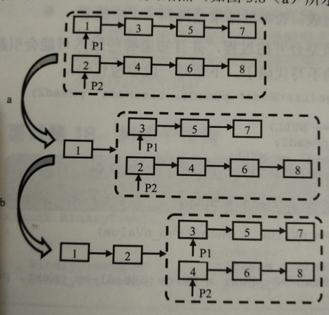

# <center> NO18 合并两个排序的链表
> 题目要求

    输入两个单调递增的链表，输出两个链表合成后的链表，当然我们需要合成后的链表满足单调不减规则。

> 分析

    定义两个指针。

    1. 先判断两个链表是否为空。

    2. 由于这个链表没有头结点，所以要判断第一个节点哪个大，让小的链表的第一个节点作为合并链表的第一个节点。

    3. 遍历两个链表，如果两个链表的长度不一样，则将长链表剩下的部分直接连接到合并链表的后面。
<center></center>

> 代码

```java 
public class Solution {

    public ListNode Merge(ListNode list1, ListNode list2) {
            if(list1==null)
                return list2;
            if(list2==null)
                return list1;
            ListNode res = null;
            if(list1.val<list2.val){
                res = list1;
                res.next = Merge(list1.next, list2);
            }else{
                res = list2;
                res.next = Merge(list1, list2.next);
            }
            return res;
        }
}
```