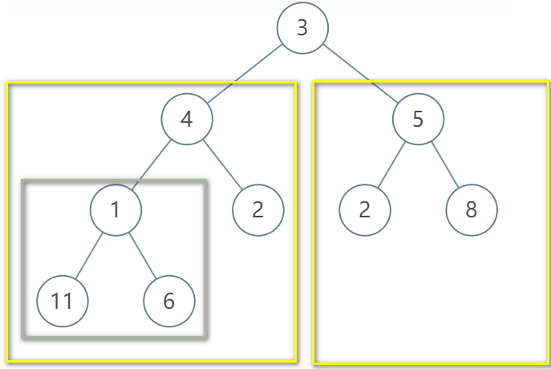

# <center> NO19 树的子结构
> 题目要求

    输入两棵二叉树A，B，判断B是不是A的子结构。（ps：我们约定空树不是任意一个树的子结构）

<center></center>

> 代码

```java 
public class Solution {
    public boolean HasSubtree(TreeNode root1,TreeNode root2) {//在A中查找与B的根节点一样的节点
        if(root1 == null || root2 == null){//存在空树
            return false;
        }
        //如果根节点一样，就要再判断子树是否跟B的结构一样
        //如果根节点不一样，就要遍历左子树
        //如果根节点不一样，就要遍历右子树
        return isSubtree(root1,root2)||HasSubtree(root1.left,root2)||HasSubtree(root1.right,root2);

    }

     public boolean isSubtree(TreeNode root1,TreeNode root2) {
         /如果root2先遍历完，就返回true，全部匹配
        if(root2==null)
            return true;
        //如果root1已经遍历完了，就返回false
        if (root1==null)
            return false;
        if(root1.val==root2.val)
            return isSubtree(root1.left,root2.left)&&isSubtree(root1.right,root2.right);
         
        return false;
    }
}
```