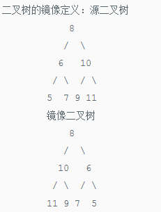
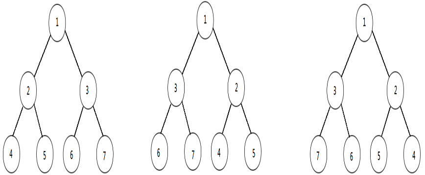

# <center> NO20 二叉树的镜像
> 题目要求

    操作给定的二叉树，将其变换为源二叉树的镜像。

<center></center>
<center></center>

> 代码

```java 
public class Solution {
    public void Mirror(TreeNode root) {
        TreeNode temp = null;
        if(root!=null){
            temp = root.left;
            root.left = root.right;
            root.right = temp;
            Mirror(root.left);
            Mirror(root.right);
        }
    }
}
```