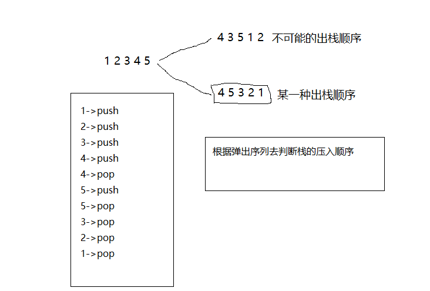

# <center> NO23 栈的压入 弹出序列
> 题目要求

    输入两个整数序列，第一个序列表示栈的压入顺序，请判断第二个序列是否可能为该栈的弹出顺序。假设压入栈的所有数字均不相等。例如序列1,2,3,4,5是某栈的压入顺序，序列4,5,3,2,1是该压栈序列对应的一个弹出序列，但4,3,5,1,2就不可能是该压栈序列的弹出序列。（注意：这两个序列的长度是相等的）

>原理分析
    方法一：对入栈序列进行入栈的模拟，然后在模拟的过程当中，判断栈顶元素和出栈序列的相等关系，从而判断出对栈顶元素的操作。
<center></center>


> 代码

```java 
import java.util.Stack;
public class Solution {
public boolean IsPopOrder(int [] pushA,int [] popA) {
        Stack<Integer> stack = new Stack<>();
        int pushIndex = 0; // 入栈序列的下标
        int popIndex = 0; // 出栈序列的下标

        while (pushIndex < pushA.length) {
            if (!stack.isEmpty() && stack.peek() == popA[popIndex]) {
                stack.pop();
                popIndex++;
            } else {
                stack.push(pushA[pushIndex]);
                pushIndex++;
            }
        }

        // 下面的这个while循环其实就是为了防止当所有入栈的元素都压入栈的时候，栈顶元素和出栈序列的下标所指的数字没有来得及比较。
        while (!stack.isEmpty()) {
            if (stack.peek() == popA[popIndex]) {
                stack.pop();
                popIndex++;
            } else {
                return false;
            }
        }
        return true;

    }
}
```