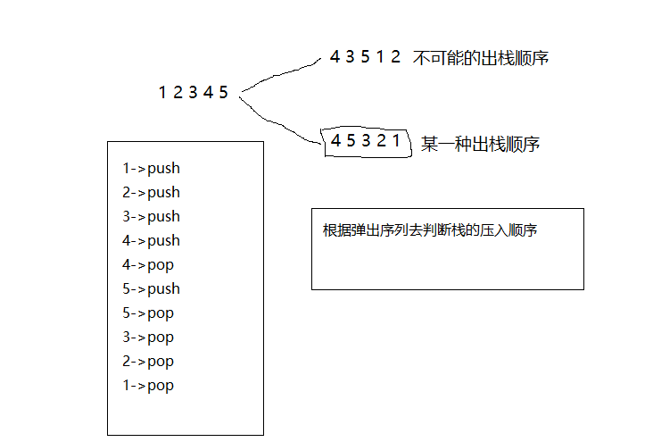

# <center> NO56 删除链表中的重复结点
> 题目要求

    在一个排序的链表中，存在重复的结点，请删除该链表中重复的结点，重复的结点不保留，返回链表头指针。 例如，链表1->2->3->3->4->4->5 处理后为 1->2->5

>原理分析

    方法一：首先判断出最终的链表的头节点，然后从头节点开始到链表的尾部节点这段区间内的节点元素，判断每一个节点是否满足非重复的的条件，如果满足，则将该节点采用尾接法的方式去添加到最终挂你的链表中去。
<center></center>


> 代码

```java 
private ListNode change(ListNode x) {
        int temp = x.val;
        while (x != null && x.val == temp) {
            x = x.next;
        }
        return x;
    }
    public ListNode deleteDuplication(ListNode pHead) {
        ListNode ans = pHead; // 最终链表的头节点
        // 确定最终链表的头节点
        while (ans != null) {
            if (ans.next != null && ans.val == ans.next.val) {
                // 当前ans所指的节点是重复节点
                ans = change(ans);
            } else {
                // 当前ans所指的节点就是我们最终链表的头节点
                break;
            }
        }
        if (ans == null) {
            return null;
        }
        // 判断从ans到链表的尾部，判断每一个节点是否为重复节点。
        ListNode lastNode = ans; // 最终链表的尾部节点
        ListNode removeNode = lastNode.next; // 遍历剩余的节点的变量
        while (removeNode != null) {
            if (removeNode.next != null && removeNode.val == removeNode.next.val) {
                // 当前removeNode所指的节点是重复节点
                removeNode = change(removeNode);
            } else {
                lastNode.next = removeNode;
                lastNode = removeNode;
                removeNode = removeNode.next;
            }
        }
        lastNode.next = null; // 1 -> 2 -> 3 -> 4 -> 4
        return ans;
    }
```