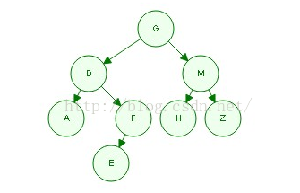
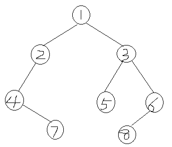

# <center>NO6 重建二叉树
>题目要求

    输入某二叉树的前序遍历和中序遍历的结果，请重建出该二叉树。假设输入的前序遍历和中序遍历的结果中都不含重复的数字。例如输入前序遍历序列{1,2,4,7,3,5,6,8}和中序遍历序列{4,7,2,1,5,3,8,6}，则重建二叉树并返回。

>分析-方法一

    1. 要使用这个方法，首先要import java.util.*;

    2. Arrays.copyOfRange(T[ ] original,int from,int to)

    3. 将一个原始的数组original，从下标from开始复制，复制到上标to，生成一个新的数组。

    4. 注意这里包括下标from，不包括上标to。
>已知前序、中序、求后序遍历
    例如：

    前序遍历:         GDAFEMHZ

    中序遍历:         ADEFGHMZ

>画树求法：

    1. 根据前序遍历的特点，我们知道根结点为G

    2. 观察中序遍历ADEFGHMZ。其中root节点G左侧的ADEF必然是root的左子树，G右侧的HMZ必然是root的右子树。

    3. 观察左子树ADEF，左子树的中的根节点必然是大树的root的leftchild。在前序遍历中，大树的root的leftchild位于root之后，所以左子树的根节点为D。

    4. 同样的道理，root的右子树节点HMZ中的根节点也可以通过前序遍历求得。在前序遍历中，一定是先把root和root的所有左子树节点遍历完之后才会遍历右子树，并且遍历的左子树的第一个节点就是左子树的根节点。同理，遍历的右子树的第一个节点就是右子树的根节点。

    5. 观察发现，上面的过程是递归的。先找到当前树的根节点，然后划分为左子树，右子树，然后进入左子树重复上面的过程，然后进入右子树重复上面的过程。最后就可以还原一棵树了。该步递归的过程可以简洁表达如下：

1 确定根,确定左子树，确定右子树。

2 在左子树中递归。

3 在右子树中递归。

4 打印当前根。

那么，我们可以画出这个二叉树的形状：

<center></center>
那么，根据后序的遍历规则，我们可以知道，后序遍历顺序为：AEFDHZMG

>实例
<center></center>
    
    前序遍历：1,2,4,7,3,5,6,8
    后序遍历：4,7,2,1,5,3,8,6
>代码
```java

import java.util.*;
public class Solution {
    public TreeNode reConstructBinaryTree(int [] pre,int [] in) {
        if(pre.length == 0 || pre.length!=in.length) return null;
        TreeNode node = new TreeNode(pre[0]);
        for(int i=0 ;i < in.length; i++){
            if(pre[0]==in[i]){
                node.left=reConstructBinaryTree(Arrays.copyOfRange(pre,1,i+1),Arrays.copyOfRange(in,0,i));
                node.right = reConstructBinaryTree(Arrays.copyOfRange(pre,i+1,pre.length),Arrays.copyOfRange(in,i+1,in.length)); 
            }
        }
        return node;
    }
}
```

