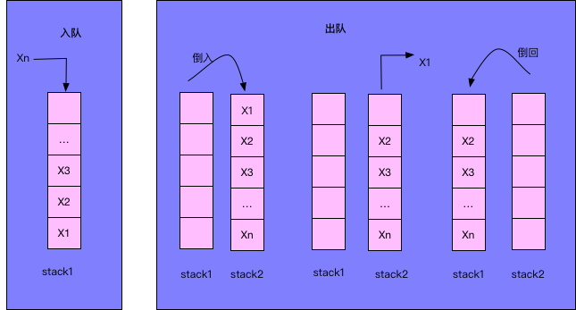

# <center>NO7 用两个栈实现队列
>题目要求

    用两个栈来实现一个队列，完成队列的Push和Pop操作。 队列中的元素为int类型。

>分析

    1. 入队时，将元素压入stack1。
    2. 出队时，判断stack1是否为空，若不为空，则将stack1的元素逐个倒入stack2，然后把stack2的栈顶元素弹出并出队，最后判断stack2是否为空，若不为空，则将stack2的元素逐个倒回stack1。
<center></center>

> 代码

```java

import java.util.Stack;

public class Solution {
    Stack<Integer> stack1 = new Stack<Integer>();
    Stack<Integer> stack2 = new Stack<Integer>();
    
    public void push(int node) {
        stack1.push(node);
    }
    
    public int pop() {
        if(stack2.size()<= 0){
            while(stack1.size()!=0){
                stack2.push(stack1.pop());
            }
        }
        return stack2.pop();
    }
}
```

