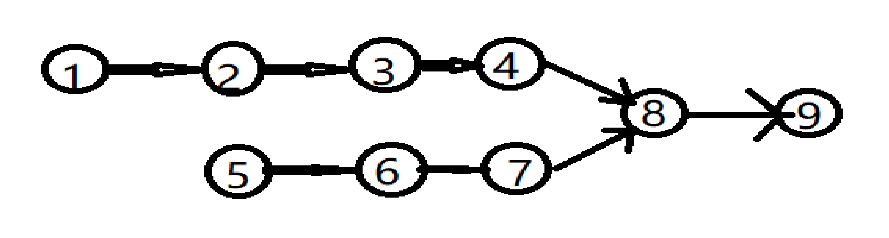

# <center> NO37 两个链表的第一个公共的结点
> 题目要求

   输入两个链表，找出它们的第一个公共结点。（注意因为传入数据是链表，所以错误测试数据的提示是用其他方式显示的，保证传入数据是正确的）
<center></center>

> 代码  
    
        方法一：通过栈去模拟从链表的尾部往前遍历两个链表的重合的部分，找到最左侧重合点即可

```java 
    public ListNode FindFirstCommonNode(ListNode pHead1, ListNode pHead2) {
        Stack<ListNode> stack1 = new Stack<>();
        Stack<ListNode> stack2 = new Stack<>();

        while (pHead1 != null) {
            stack1.add(pHead1);
            pHead1 = pHead1.next;
        }
        while (pHead2 != null) {
            stack2.add(pHead2);
            pHead2 = pHead2.next;
        }
        ListNode ans = null;
        while (!stack1.isEmpty() && !stack2.isEmpty()) {
            if(stack1.peek().val == stack2.peek().val) {
                ans = stack1.peek();
                stack1.pop();
                stack2.pop();
            } else {
                break;
            }
        }
        return ans;
    }
```

>方法二：

    先去判断两个链表的长度，移动其中一个链表的头节点，使其两个链表的长度一样，最后从两个链表的头部开始遍历，找到第一个重合点即可。

>代码

```java
public ListNode FindFirstCommonNode(ListNode pHead1, ListNode pHead2) {
        int len1 = 0;
        int len2 = 0;
        ListNode removeNode1 = pHead1;
        ListNode removeNode2 = pHead2;
        while (removeNode1 != null) {
            len1++;
            removeNode1 = removeNode1.next;
        }
        while (removeNode2 != null) {
            len2++;
            removeNode2 = removeNode2.next;
        }

        // 下面的两个判断就是是的两个链表的length相同
        if (len1 > len2) {
            for (int i = 1; i <= len1 - len2; i++) {
                pHead1 = pHead1.next;
            }
        } else if (len2 > len1) {
            for (int i = 1; i <= len2 - len1; i++) {
                pHead2 = pHead2.next;
            }
        }
        ListNode ans = null;
        while (pHead1 != null) {
            if (pHead1.val ==pHead2.val) {
                ans = pHead1;
                break;
            }
            pHead1 = pHead1.next;
            pHead2 = pHead2.next;
        }
        return ans;
    }
```